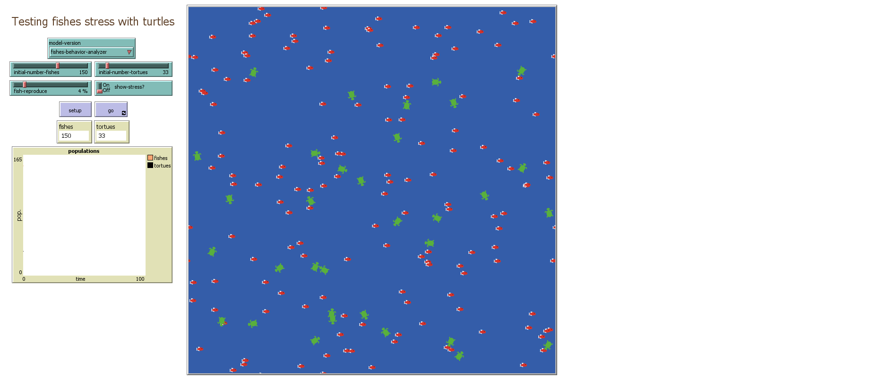

# Fish Turtles Ecosystem Model

This is the official repository for the Fish Turtles Ecosystem model, a simulation of the interaction between fishes and tortoises in a virtual sea environment. The model is developed by Antoine Porte and Antoine Neyra as part of their research at ENSC, Bordeaux INP, France.

## What is it?

This model simulates the interaction between two types of agents: fishes and tortoises. The fishes have a characteristic called "stress," and the population of fishes is limited to prevent it from growing too large. The fishes move around in a simulated sea environment, interact with each other and the tortoises, and can reproduce under certain conditions. The stress level of fishes is affected by the presence of tortoises in their vicinity, and when fishes are too stressed, they may die. The behavior of the tortoises is to move and interact with nearby fishes.

## How it works

This model consists of two breeds: "fishes" and "tortoises." Fishes have a characteristic called "stress." The simulation is set in a sea environment represented by blue patches.

The model initializes by creating an initial population of fishes and tortoises on random patches in the sea. Fishes are represented by red fish shapes, and tortoises are represented by green turtle shapes.

The behavior of fishes includes movement, reproduction, and stress management. They may reproduce if their stress is below a certain threshold, and they are more stressed if there are tortoises in their vicinity. Fishes can also die if their stress level exceeds a critical value.

The tortoises' behavior involves moving and interacting with nearby fishes.

## How to use it

1. Set the maximum number of fishes using the "max-fishes" global variable.
2. Press the "Setup" button to initialize the simulation with the specified parameters.
3. Press the "Go" button to start the simulation.
4. Observe the behaviors of fishes and tortoises in the sea environment.
5. Monitor the stress levels of fishes if the "show-stress?" option is enabled.

### Parameters:

- **max-fishes**: The maximum number of fishes allowed in the simulation.
- **initial-number-fishes**: The initial number of fishes in the simulation.
- **initial-number-tortoises**: The initial number of tortoises in the simulation.
- **fish-reproduce**: The probability of a fish reproducing at each time step.
- **show-stress?**: Whether or not to display the stress levels of fishes as labels.

## Things to notice

- Observe how the fish population fluctuates and how it is affected by the presence of tortoises.
- Pay attention to the stress levels of fishes and how they change based on the proximity of tortoises.
- The simulation may stop if the fish population becomes too large or if there are no more fishes left.

## Things to try

- Experiment with different parameter values to see how they affect the stability and behavior of the ecosystem.
- Observe the impact of changing the "max-fishes" limit on the simulation's outcome.
- Analyze the interaction patterns between fishes and tortoises and how they influence stress levels.

## Extending the model

- You can extend the model by introducing additional behaviors for fishes and tortoises.
- Modify the reproduction rules or stress calculations to explore different scenarios.
- Implement new features such as fish migration, predation, or territorial behavior.

## NetLogo Features

- This model uses breeds to define two types of agents: fishes and tortoises.
- It employs patches to represent the sea environment.

## Credits and References

**Authors:** Antoine Porte and Antoine Neyra

## How to Cite

If you mention this model or the NetLogo software in a publication, we ask that you include the citation below:

**For the model itself:**

Antoine Porte and Antoine Neyra (2023). NetLogo Fish Turtles Ecosystem model. [GitHub Repository](https://github.com/Antoine005/netlogo) ENSC, Bordeaux INP, FRANCE.

**Please cite the NetLogo software as:**

Wilensky, U. (1999). NetLogo. [NetLogo Website](http://ccl.northwestern.edu/netlogo/). Center for Connected Learning and Computer-Based Modeling, Northwestern University, Evanston, IL.
